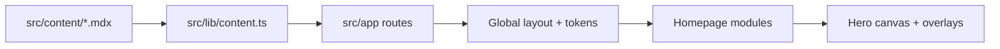

## Code Review
- **Date:** 2026-03-06 15:57 EST
- **Model:** Codex (GPT-5)
- **Branch:** main
- **Latest Commit:** 579d57b
- **Linear Story:** ASMV-24
---

### Test Gate (Phase 2)
- `pnpm lint`: PASS, 0 ESLint warnings, 0 ESLint errors.
- `pnpm build`: FAIL.
- Build failures observed: 2 runs, 2 failures, both ENOENT filesystem errors during Next build output handling.
  - Run 1: missing `.next/server/pages-manifest.json`
  - Run 2: missing source during rename `.next/export/500.html -> .next/server/pages/500.html`

**Blocking status:** Build is currently not passing locally, so this branch is not merge-ready under the required quality gate.

### What The Current Repo Implements (Phase 3)
1. Next.js App Router site with MDX-backed content collections (`now`, `writing`, architecture work, software work).
2. Shared typography and color system through CSS tokens + Tailwind extension.
3. Homepage combines static editorial layout with a custom hero canvas and artifact rail fed from daily-entry content.
4. Documentation layer (`PRD.md`, `brand-guide.md`, `CLAUDE.md`, `AGENTS.md`) acts as operating spec for design, implementation, and agent workflow.

Mermaid flow (runtime + content path):

### General Feedback (Architectural + Tactical)
The implementation direction is coherent: content model, routing structure, and typographic hierarchy are aligned with the MVP. The major risk is now documentation/system drift: multiple top-level references disagree with the actual code and palette. That drift is already leaking into implementation details (hardcoded old palette values in visual components), which undermines the core brand/design objective and makes future agent/human work error-prone.

### Findings
#### Blockers
1. ✅ Confirmed — `pnpm build` fails reproducibly (2/2 runs), so the required release gate is red.
   - Evidence: local command output during this review; ENOENT failures in Next build artifact handling.
   - Impact: cannot claim production-ready build health for `main`.

#### Important
2. ✅ Confirmed — `AGENTS.md` typography roles are incorrect vs actual code and internal docs.
   - Evidence: `AGENTS.md:98` and `AGENTS.md:183` state heading/body roles opposite to implementation.
   - Ground truth: `src/styles/globals.css:33-39` sets headings to serif; `src/app/layout.tsx:21` sets body `font-sans`; `src/lib/fonts.ts:7-9` confirms role assignment.
   - Impact: high risk of future design/code decisions being made on wrong typography rules.

3. ✅ Confirmed — `brand-guide.md` design-token section claims parity with code but contains outdated pre-Riso values.
   - Evidence: `brand-guide.md:391-392` claims token parity; `brand-guide.md:452-480` defines terracotta/amber/cream palette.
   - Ground truth: `src/styles/tokens.css:62-90` and `tailwind.config.ts:12-34` use Riso palette (`paper`, `oxblood`, `scarlet`, etc.).
   - Impact: source-of-truth conflict for brand system; likely to cause incorrect future implementation.

4. ✅ Confirmed — visual runtime code still hardcodes old palette values in hero rendering path.
   - Evidence: `src/lib/hero-canvas.ts:68-69` (`#F5F0E8`, `44,40,36`) and multiple usages.
   - Ground truth: current token palette is `--color-background: #FDFCEA`, `--color-ink: #471f20` in `src/styles/tokens.css:71,76`.
   - Impact: homepage hero can drift from current design system even when tokens are updated.

5. ✅ Confirmed — `HeroBrandVisual` overlay text/dot colors are hardcoded to old RGB values.
   - Evidence: `src/components/interactive/HeroBrandVisual.tsx:189,205,219,233,241` use `rgba(44,40,36,...)`.
   - Impact: same design-token bypass as item 4; increases maintenance overhead and visual inconsistency.

6. ✅ Confirmed — top-level docs still describe old color language in key guidance.
   - Evidence: `AGENTS.md:105` and `CLAUDE.md:103` describe warm terracotta/amber/ochre palette as active visual language.
   - Ground truth: codebase tokens and Tailwind are now Riso-based.
   - Impact: persistent agent guidance drift, especially for future design tasks.

7. ✅ Confirmed — PRD technical constraints are stale relative to current decided stack/hosting.
   - Evidence: `PRD.md:326-327` still says tech stack/hosting TBD.
   - Impact: onboarding and planning friction; spec appears unresolved despite implementation decisions.

8. ✅ Confirmed — Research deliverables tables are incomplete versus actual repository contents.
   - Evidence: `research/03-gemini-imagen-research.md` and `research/04-brand-identity-notes.md` exist, but deliverables tables in `AGENTS.md:135-142` and `CLAUDE.md:107-113` omit them.
   - Impact: research visibility gap; agents may ignore relevant completed work.

9. ✅ Confirmed — CLAUDE lessons mention dev dependencies that are not present.
   - Evidence: `CLAUDE.md:217` says `simplex-noise` and `@napi-rs/canvas` installed; `package.json` has neither in dependencies/devDependencies.
   - Impact: misleading setup expectations and failed reproducibility for documented workflows.

10. ✅ Confirmed — Lattice workflow drift: merged tasks left in `review` state.
   - Evidence: `lattice list --status review --json` shows `ASMV-20` and `ASMV-21` still in review.
   - Impact: board state is inaccurate; coordination and historical tracking degrade.

#### Potential
11. ⬇️ Lower priority, valid but non-blocking — legacy alias naming remains in live UI classes/selection styles.
   - Evidence: `src/styles/globals.css:67-68` (`--color-vermillion`, `--color-cream`), `src/components/interactive/ArtifactBar.tsx:168` (`text-vermillion`).
   - Note: values currently resolve correctly through alias mapping in `src/styles/tokens.css:78-81` and `tailwind.config.ts:20-24`.
   - Impact: mostly semantic debt; low immediate runtime risk.

12. ❓ Uncertain or needs discussion — placeholder content is still shipping in portfolio/writing collections.
   - Evidence: `src/content/work-architecture/sample-project.mdx`, `src/content/work-software/sample-project.mdx`, `src/content/writing/hello-world.mdx`.
   - Impact depends on launch intent: acceptable in active build phase, but should be tracked if public launch/readiness is being assessed.

### Validation Pass Summary (Phase 5)
- Re-read all Blocker + Important file sections directly with line-level verification.
- Re-ran build to validate blocker reproducibility (failed again with a different ENOENT location).
- Confirmed all listed Blocker + Important items exist in current repo state and are in-scope for this full-repo audit.
